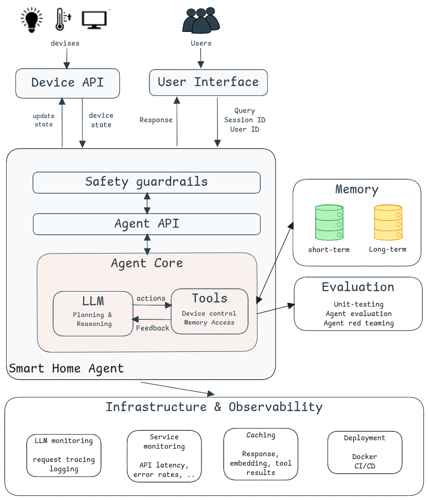

<div align="center">
  <h1>Smart Home Agent – A Ground-Up Course on Building LLM-Based Agents</h1>
  <h3>Learn how to build a production-grade agentic system</h3>
  <p class="tagline">Open-source course by <a href="https://fastbatch.substack.com/">Fast Batch</a> 
  <!-- in collaboration with </br> <a href="https://rebrand.ly/second-brain-course-mongodb">MongoDB</a>, <a href="https://rebrand.ly/second-brain-course-comet">Comet</a>, <a href="https://rebrand.ly/second-brain-course-opik">Opik</a>, <a href="https://rebrand.ly/second-brain-course-unsloth">Unsloth</a> and <a href="https://rebrand.ly/second-brain-course-zenml">ZenML</a>.</p> -->
</div>


<!-- # 🏡 Smart Home Agent – A Ground-Up Course on Building LLM-Based Agents -->
[](LICENSE)
[](https://www.python.org/downloads/)
[](https://github.com/langchain-ai/langgraph)
[](./tests)
[](https://fastbatch.substack.com/p/lets-build-a-smart-home-agent-together)

---
<p align="center">
    <a href="https://fastbatch.substack.com/p/lets-build-a-smart-home-agent-together">   
  
  </a>
</p>


Welcome! This is an open-source course that walks you through building a smart home agent from scratch. This is a **hands-on** project that covers the **full stack**, from agent design and LLM integration to MLOps pipelines, monitoring, deployment infrastructure, and everything in between.

**This is not a series with a fixed timeline**. This is a long-term journey where we’ll build, break, and rebuild until we have something that actually works in production. 


### What You'll Do:
- Build the agent architecture and reasoning logic

- Integrate evaluation and testing strategies

- Implement observability and monitoring tools

- Secure your agent with safety guardrails

- Design deployment pipelines and infrastructure

---

This repo accompanies the course published on Substack, where each module is explained with code walk-through and lessons learned.

<p align="center">
  <a href="https://fastbatch.substack.com/">
    
  </a>
</p>

## Getting started
1- Create a virtual environment and install the project dependencies
```bash
uv pip install -e .
```
2- Create a `.env` file by coping the `.env_example` file and add the necessary API keys

3- Setup Opik for monitoring 
```bash
opik configure
```
You will need to login and get the API key from your account
4- Run your agent 
```
python run.py
```

## Course Outline
This **open-source series consists of 8 modules**. This course is still under-development, thus more modules can be added. 

**The best way to follow along** is to clone the repository and run the code. We purposefully setup different branches for different modules to make it easy to navigate through the code. 

| Module | Substack | Description | Running the code |
|--------|-----------|-------------|------------------|
0 | [Introduction](https://fastbatch.substack.com/p/lets-build-a-smart-home-agent-together)| Series announcement | - |
1 | [Build your smart home agent](https://fastbatch.substack.com/p/build-a-smart-home-agent) | Implement a simple agent that controls devices | [Demo](https://github.com/fastbatchai/smart-home-agent/blob/lesson-1/demo.py) |
2 | [Personnalize your agent]() | Add a memory layer to personnalize your agent's response | -
3 | [Deploy your agent]() | Design the deployment architecture | -
4 | [Evaluate your agent]() | Evaluate if your agent if ready for production | -
5 | [Red team your agent]() | Evaluate your agent's robustness against attacks | -
6 | [Secure your agent]() | Implement safety guardrails | - |
7 | [Monitor your agent]() | Add observability and monitoring pipelines | - |
8 | [Scale up your agent]() | How to scale your deployment pipele | - |


## 📤 Contributing
This is a solo project for now, but PRs that improve clarity, fix bugs, or suggest useful utilities are welcome. If you’re building something similar, feel free to reach out or open an issue to discuss!


